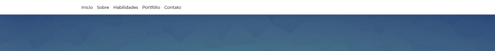
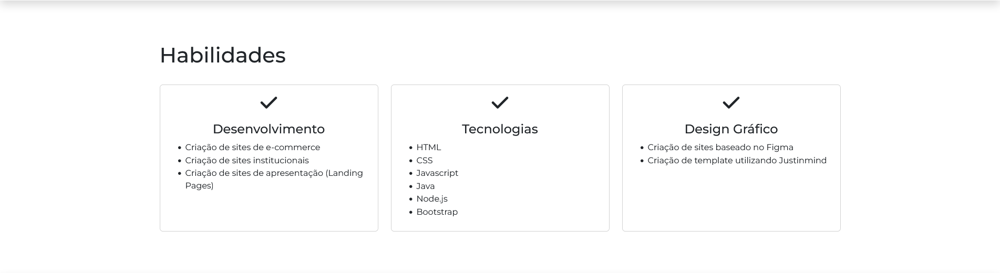
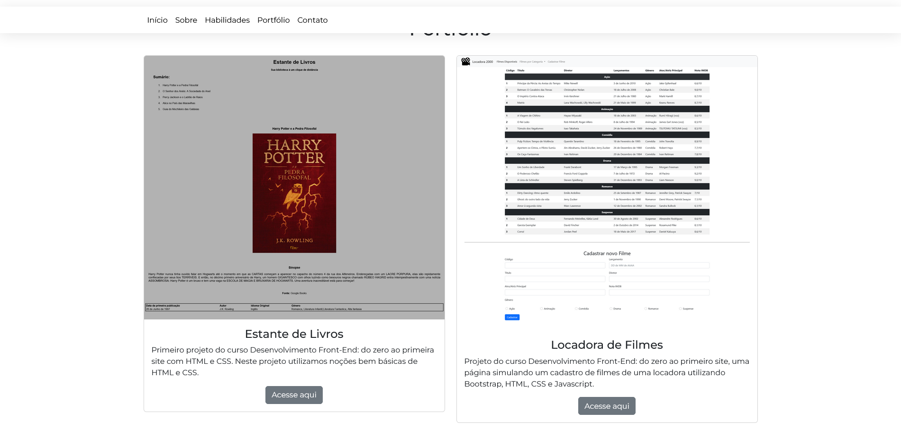
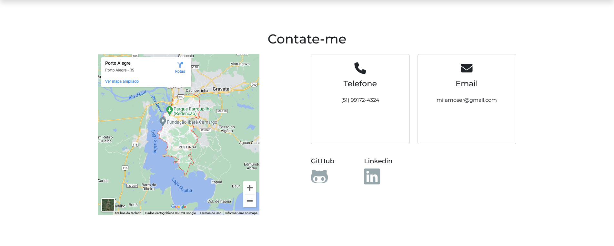
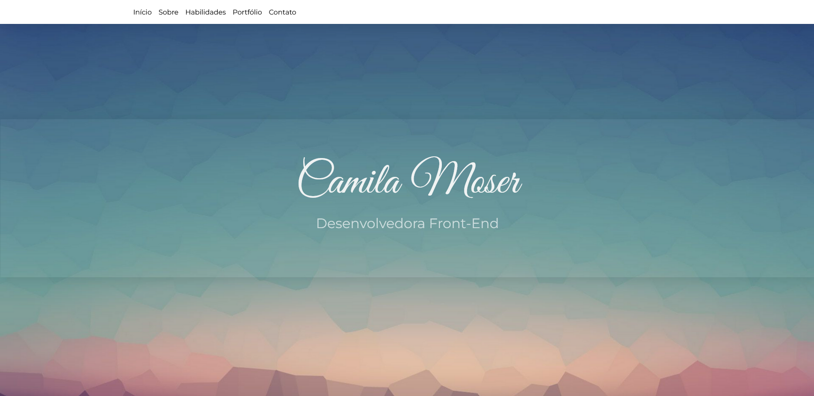
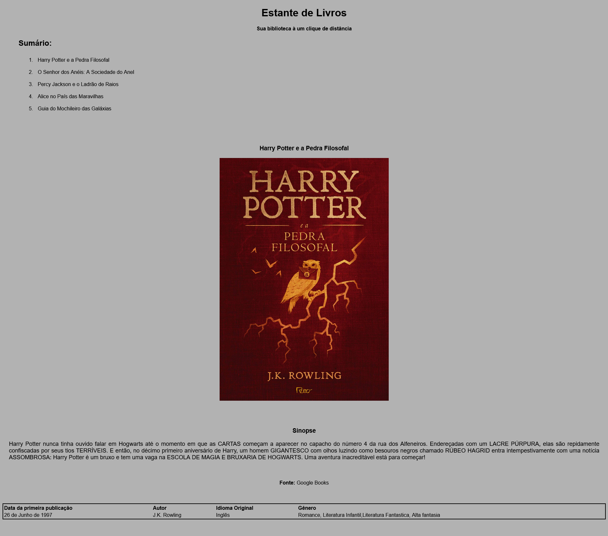
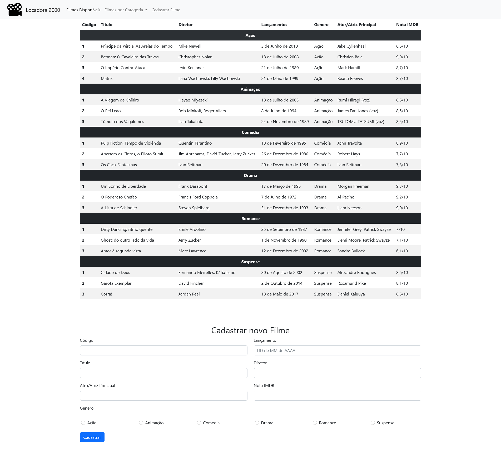
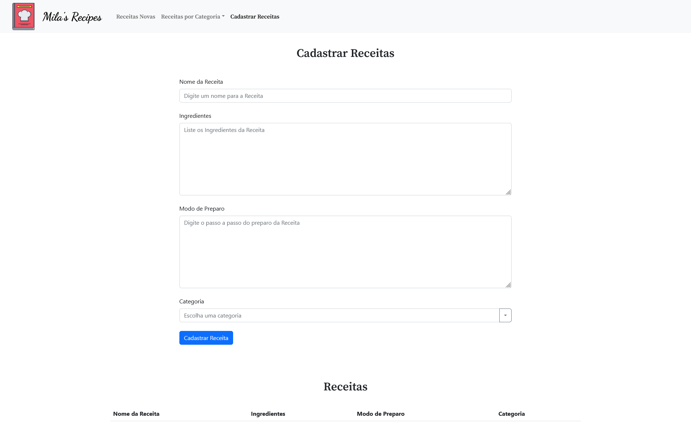
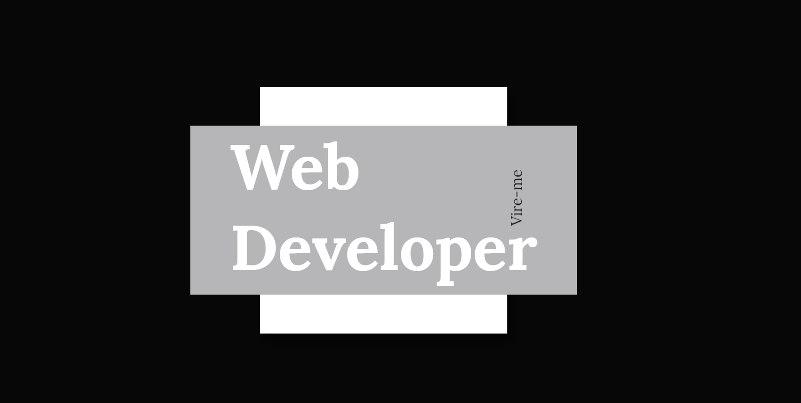

# Projeto Final - Camila Moser
Projeto final do curso Desenvolvimento Front End: do zero ao primeiro site do programa +praTi

## Estrutura básica

Este projeto foi implementado utilizando as técnicas aprendidas durante todo o curso do programa +praTi, as tecnologias e linguagens aprendidas no curso, foram utilizadas neste projeto final como: HTML, CSS, Javascript e Bootstrap. Foram utilizadas boas práticas de programação e de responsividade do site para diferentes dispositivos.

  

## Bootstrap

 Foi escolhido o framework Bootstrap para a criação dos componentes visuais do site como botões, menu e cards. Com o framework bootstrap facilita a implementação destes componentes mantendo um padrão visual e reutilizável.

  
  
  
  

  

## Glassmorphism

 O Glassmorphism é uma proposta de design minimalista e que visa reproduzir uma sensação mais realista nos componente, é uma tentativa de simular uma película de vidro em alguma aplicação.

  

  

## Outros projetos

 Abaixo alguns projetos que foram desenvolvidos durante o curso.

  
  
  
  

<a align="center" href="https://github.com/ProfTau" target="_blank">  link de alguma coisa</a>

